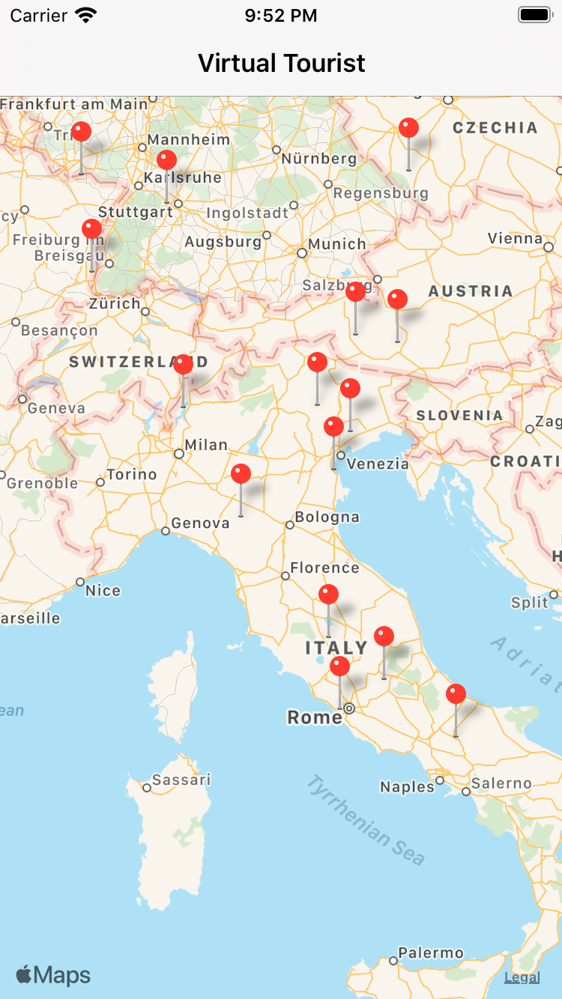
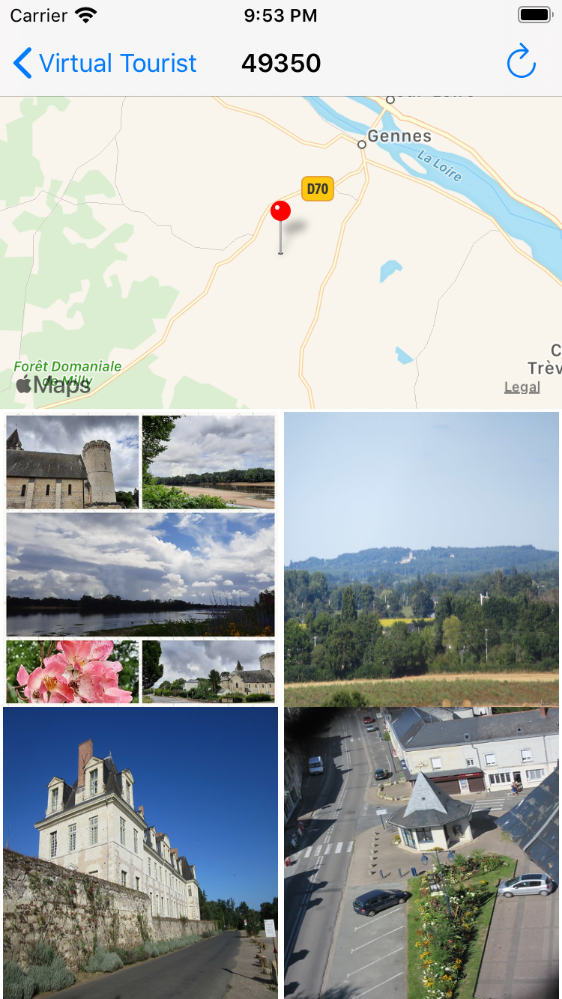

# Virtual Tourist

This app allows user to pin their location on the map and also use [Flickr](https://www.flickr.com) api to download and store photos of that location.


## What you need to do

This app use [Flickr](https://www.flickr.com) api to get pictures.
so you need sign up in flicker and get your api key.

After you get your api key modify this file **ApiClient.swift**

```swift
  struct Auth {
        static let apiKey = "Your Api Key Goes Here"
    }
```

## Screenshots


